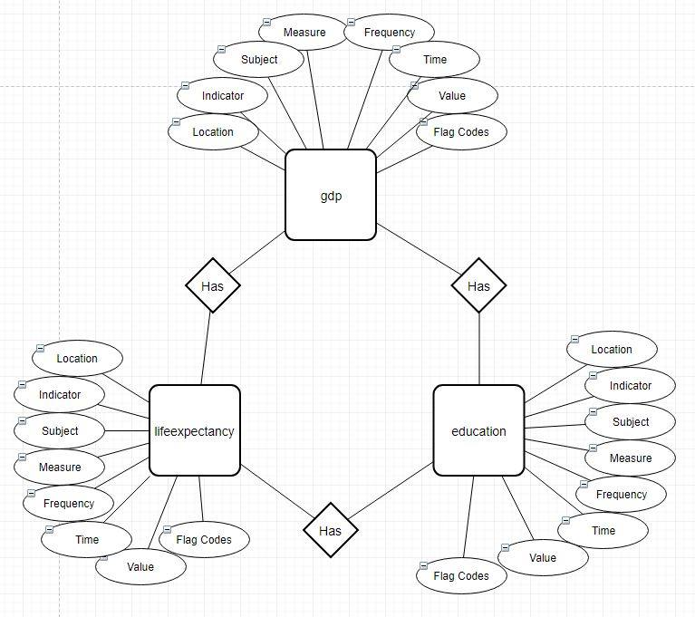

# OECD-Modelling
### 1. Have a look at the files and draw a logical data model
From the csv files I have made a general overview of these files and what they contains via an ERD model.

As seen from the ERD model the attributes they contain are very much the same, so I made some tables from these entities attributes, as seen below:

