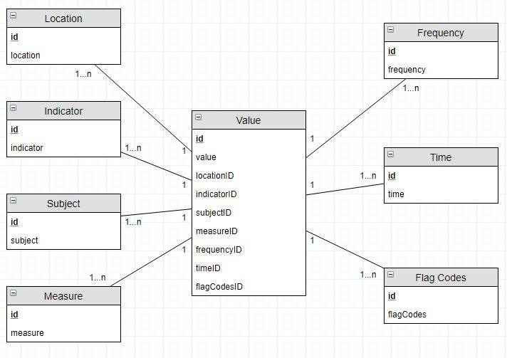
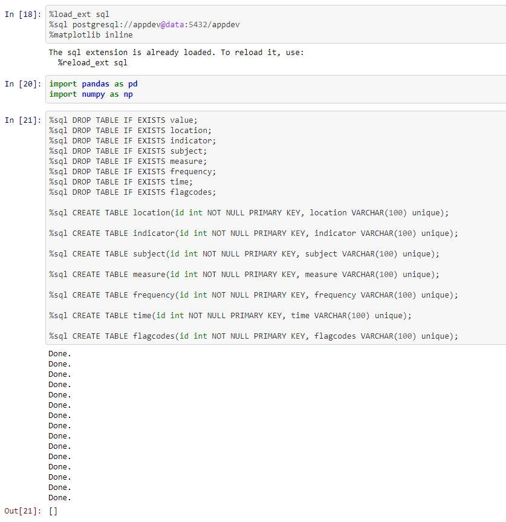
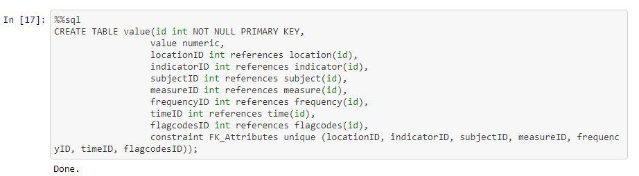

# OECD-Modelling
### 1. Have a look at the files and draw a logical data model
From the csv files I have made a general overview of these files and what they contains via an ERD model.

As seen from the ERD model the attributes they contain are very much the same, so I made some tables from these entities attributes, as seen below:

### 2. Transfer that logical data model into a physical data model and create the necessary tables in PostgreSQL
So from the physical model I have made a logical model with the tables designed like this:

### 3. Load all the data into your database - Hint: You can do this in Python very easily if you load the csv data using Pandas (pandas.read_csv) and iterate over the rows.
Before you can load all the data from the csv files into your database, you have to make sure you can reach the files. You do this by placing the csv files in the same folder you are running the ipynb file.

This can be seen here:

### 4. Find the country whose GDP has grown the most over time and plot the level of education on the x axis and the life expectancy on the y axis. Do the same thing for the country whose GDP has grown the least over time
TBD
